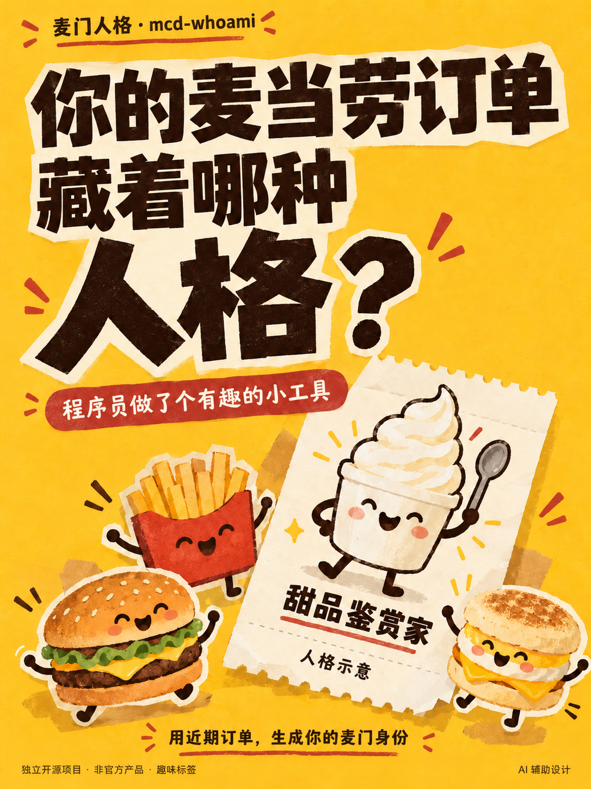
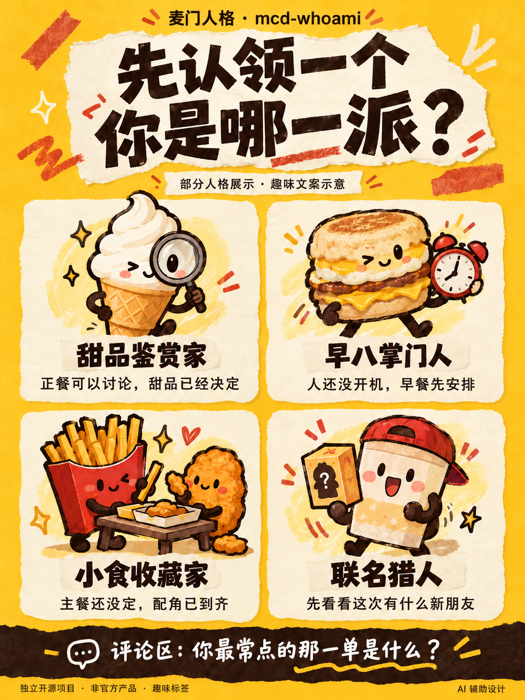
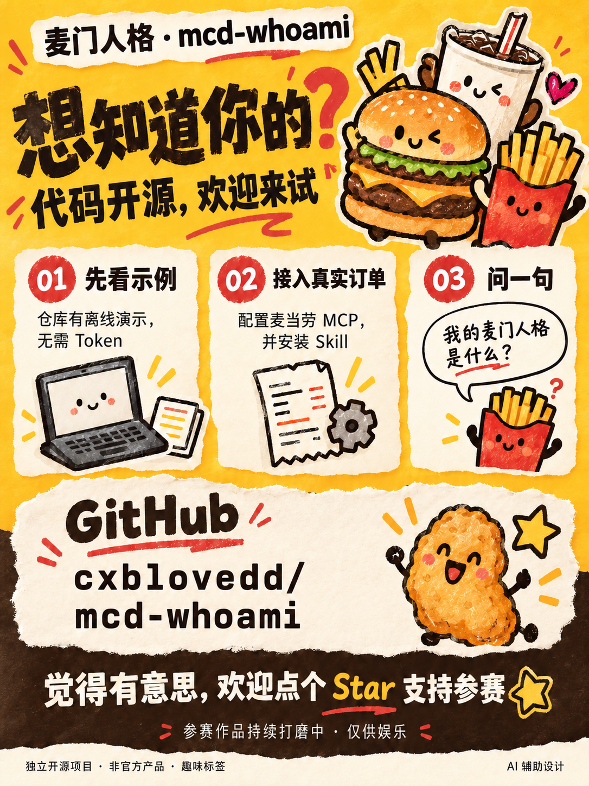

<div align="center">

# 麦门人格 · mcd-whoami

**你在麦门是什么人？**

用你的真实麦当劳订单，算出你是哪种麦门人格。

[](https://github.com/M-China/mcd-mcp-server)
[](https://www.workbuddy.cn)

</div>

<p align="center">
  <a href="marketing/xiaohongshu/2026-10-09-01/01-cover.png">
    
  </a>
</p>

---

## 它不分析你吃了什么，它定义你是谁

点餐助手都在算卡路里、算价格。没人告诉你：**你在这家快餐店里，是个什么样的人。**

麦门人格读完你的真实订单，给你一个人格标签 —— 然后你会想发给同事。

```markdown
你在麦门是什么人：甜品鉴赏家
别人吃饭，你品鉴

隐藏副人格：小食收藏家（与主人格接近 74%）

口味权重  甜品饮料 0.559 · 小食组合 0.414 · 鸡腿风味 0.238
麦门属性  午间充电站 · 跨城旅行家 · 套餐规划师
徽章收集  4 / 6
```

> 以上来自一份 12 笔订单、跨度 8 个月、覆盖 4 座城市的真实记录。

**7 型人格 · 3 组行为标签 · 6 枚可解锁徽章**，全部由真实数据推导，没有随机数。

---

## 它怎么算出你的性格

不是「数你点得最多的是什么」，而是一个可解释的加权公式：

```
S = 0.5 × F + 0.3 × R + 0.2 × P
```

| 指标 | 含义 | 为什么算它 |
|---|---|---|
| **F** 件数占比 | 该品类餐品数 / 全部餐品数 | 反映消费结构 |
| **R** 订单占比 | 含该品类的订单数 / 有效订单数 | 防止单次大量购买主导人格 |
| **P** 复购稳定性 | 出现该品类的日期数 / 全部日期数 | 判断是习惯还是偶然 |

**关键区别**：某次一次性买了 12 个鸡翅，F 很高但 R 和 P 很低 —— 加权后不会把你判成「炸鸡教父」。这正是简单计数做不到的。

### 副人格

当第二名得分与第一名接近（≥75%）时，**并列展示而不是硬选一个**。你的口味可能本来就不单一，画像不该替你做决定。

### 置信度

样本量决定可信度，画像如实标注：

| 有效订单 | 结果 |
|---|---|
| 0-2 笔 | 人格探索中，暂不解锁 |
| 3-5 笔 | 初步画像 |
| 6 笔以上 | 正式画像 |

> 麦当劳 `order-list` 接口只返回最近 10 笔订单，所以画像反映的是**近期样本**，不代表长期习惯。

---

## 体系一览

**7 型人格**（按口味加权得分决定）

| 甜品饮料 | 鸡腿风味 | 牛肉重口 | 麦满分早餐 |
|---|---|---|---|
| 甜品鉴赏家 | 炸鸡教父 | 牛肉暴君 | 早八掌门人 |

| 小食组合 | 深海鱼类 | 酱香重口 | 联名周边 |
|---|---|---|---|
| 小食收藏家 | 深海探索家 | 酱料炼金师 | 联名猎人 |

> 联名人格独立判定 —— 买一次联名周边不该定义你的口味。

**3 组行为标签**（每人各得一个）

| 维度 | 取值 |
|---|---|
| 作息 | 晨光捕手 / 午间充电站 / 黄昏漫游者 / 深夜觅食者 |
| 足迹 | 据点守护者 / 城市漫游者 / 跨城旅行家 / 外送宅家派 |
| 消费 | 零点捕手 / 经典复刻派 / 套餐规划师 / 口味探索者 |

**6 枚徽章**（条件达成才点亮）

| 徽章 | 解锁条件 |
|---|---|
| 麦门全勤王 | 3 个不同日期有有效订单 |
| 麦门探险家 | 光顾 5 家不同门店 |
| 疯狂星期四卧底 | 在周四下过单 |
| 全糖无悔 | 单笔含 2 份以上甜品 |
| 隐藏菜单大师 | 3 条餐品特制记录 |
| 联名收藏家 | 买过 2 件以上联名周边 |

没解锁的显示剪影和解锁提示 —— 稀缺感才是收集动力。

---

## 快速开始

### 环境要求

- Python 3.8+
- 麦当劳 MCP Token（[免费申请](https://open.mcd.cn/mcp)）

### 1. 配置 MCP

```bash
git clone https://github.com/cxblovedd/mcd-whoami.git
cd mcd-whoami
```

参考 `mcp-config.example.json` 配置你的 MCP 客户端：

```json
{
  "mcpServers": {
    "mcd-mcp": {
      "type": "streamablehttp",
      "url": "https://mcp.mcd.cn",
      "headers": {
        "Authorization": "Bearer ${MCD_MCP_TOKEN}"
      }
    }
  }
}
```

### 2. 安装 Skill

把仓库放入你的 Agent Skills 目录（WorkBuddy 用户在「专家 · 技能 · 连接器」中启用即可）。

### 3. 生成你的画像

在对话框里问一句：

> 我的麦门人格是什么？

或直接跑脚本：

```bash
# 离线演示，无需 Token
python3 scripts/persona_builder.py --demo

# 用真实订单生成
python3 scripts/persona_builder.py --orders orders.json
```

---

## 使用说明

| 你问 | 它做什么 |
|---|---|
| 我的麦门人格是什么？ | 人格名 + 口味权重 + 三组标签 + 徽章 |
| 生成我的麦门画像 | 同上，可指定是否要海报版 |
| 麦当劳现在有什么活动？ | 开抢倒计时 + 限量抢兑雷达 + 券池 + 积分规划 |
| 下一个开抢是什么时候？ | 只输出时间敏感情报 |

**边界情况都处理好了**：订单不满 3 笔会提示还要再积累几笔，全取消订单按 0 笔处理，全积分兑换订单标记为「权益型消费者」。**数据不足时如实说不足，不用随机数凑。**

---

## 分享海报

打开 `assets/persona-poster.html` → 点击「下载图片」得到 1080×1440 PNG，可直接发朋友圈。

海报包含人格名、隐藏副人格、口味权重条形图、三行为标签、徽章收集进度与数据档案，页脚标注加权公式。

替换 HTML 内的文本即可换成你自己的画像，详见 `assets/README.md`。

### 人格图鉴与体验指南

以下为 AI 辅助设计的宣传插画，展示趣味人格与使用方式，不是实际运行截图。点击图片可查看原图。

<table>
  <tr>
    <td align="center" width="50%">
      <a href="marketing/xiaohongshu/2026-10-09-01/02-personas.png"></a>
      <br>先认领一个：你是哪一派？
    </td>
    <td align="center" width="50%">
      <a href="marketing/xiaohongshu/2026-10-09-01/03-how-to.png"></a>
      <br>先跑离线示例，再生成自己的画像
    </td>
  </tr>
</table>

---

## 另一个能力：开抢情报

麦门人格之外，同一套 MCP 底座还能帮你盯着优惠：

- ⏰ **开抢倒计时** — 从活动文案抽出「10:45 开售」算出现时倒计时，自动剔除过期项
- 🔍 **限量抢兑雷达** — 识别积分商城里的「准时开抢 / 先到先得 / 每人限购」
- 🎫 **券池盘点** — 可领券与已持有券一目了然
- 💎 **积分规划** — 每积分换算价值对照
- 👨‍👩‍👧 **亲子活动** — 派对 / 品鉴会 / 体验营预约全链路

详见 `SKILL.md` 与 `MCP_INTEGRATION.md`。

---

## 设计原则

**不做健康建议。** 人格是趣味标签，不是营养指导。输出末尾固定带免责声明，不做任何「你摄入了过多热量」式提醒。

**不评价品牌。** 人格标签指向用户自己，不评价麦当劳的产品，也不与任何品牌对比。

**不用随机数。** 每个标签都能追溯到具体订单记录。数据不足就说不足。

**原始数据不留存。** 仓库内只有脱敏样本，真实订单数据仅在内存中处理。

---

## 项目结构

```
mcd-whoami/
├── SKILL.md                  # Skill 定义：场景路由、合规规则、输出规范
├── README.md
├── CONTEST_DECLARATION.md    # 参赛声明（官方文件，不可修改）
├── MCP_INTEGRATION.md        # Tool 清单与调用流程
├── mcp-config.example.json   # 环境变量占位符配置
├── workbuddy.md              # WorkBuddy 开发对话上下文
├── scripts/
│   ├── persona_builder.py    # 人格画像生成器（加权评分 + 徽章判定）
│   └── intel_parser.py       # 开抢时刻解析器
├── data/
│   └── sample_orders.json    # 脱敏样本订单
├── references/
│   ├── persona-template.md   # 人格体系与海报规范
│   └── output-template.md    # 情报输出模板
└── assets/
    └── persona-poster.html   # 可下载的分享海报（1080×1440）
```

---

## 致谢

数据来自[麦当劳中国 MCP Server](https://github.com/M-China/mcd-mcp-server)。本项目为个人独立开发的第三方工具，非麦当劳官方产品。活动信息、价格与库存以麦当劳官方渠道实时结果为准。

---

**觉得有意思？点个 ⭐ 让更多人算出自己的麦门人格。**